**Maven Project LAC**
===============
**Learning And Code**

최운영(https://github.com/uyCHOI) 
정진솔(https://github.com/smokerJS) 
이은비(https://github.com/eunbeeLee) 

---------------------------------------

>**Server-side** 
>Spring Framework ***80port*** 
>Node.js express ***3000,3001port*** 
>socket.io (***실시간 서버 구성 3000 : 채팅 / 3001 :  알림*** ) 
>vid-streamer ***3002port*** 
> 

>**DBMS** 
MySQL 
AWS RDS   

>**Tools** 
Eclipse 
VSCode 
MySQLWorkbench  
Balsamiq Mockups 3  

>**UI-Framework** 
sitemesh-3 
Bootstrap4  

>**FE-lib** 
jquery  

>**Version management** 
SourceTree 
(https://github.com/eunbeeLee/maven_project_lac) 

---------------------------------------
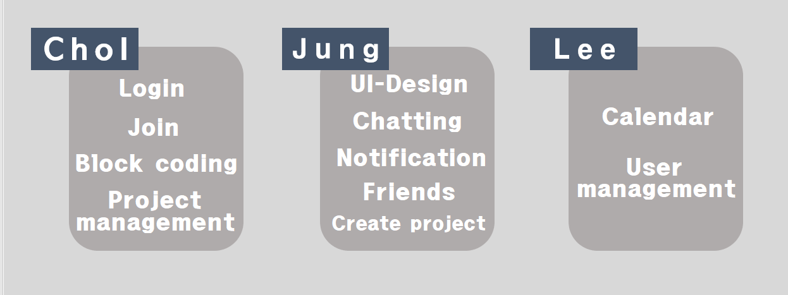

---------------------------------------

>**정진솔 - UI-Design / 채팅 / 실시간 알림 /  친구관리 / 프로젝트 생성**
>---------
>
>***node.js*** 의 **socket.io** 를 이용하여 실시간 통신 서비스 및 
>***Spring Framework*** 와 **Node Express** 의 **Cross Browsing** 구현 
>Web template 을 사용하지 않고 로그인을 제외한 모든 페이지에 
>***app*** 형식의 **UI-Design** 과 sitemesh를 통한 **Side Menu** 구성 
>  
> **핵심기능** 
>    - 실시간 알림 
>    - 친구관리 
>    - 프로젝트 생성 및 초대 
>    - 채팅 
>     
   
---------------------------------------

>Main View
>---------
>
>  
>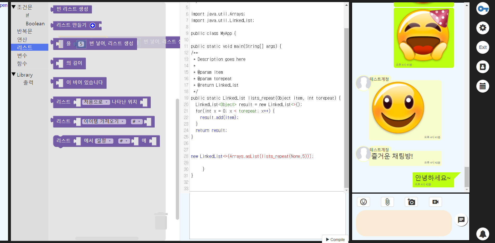 
>
>**간편한 프로젝트 생성과 다양한 기능의 채팅 서비스**  
>project lac 는 간단하게 블록코딩을 즐기며 
>친구들과 채팅을 할 수 있는 유용한 웹서비스 입니다. 

---------------------------------------

>실시간 알림과 함께하는 친구관리와 프로젝트 생성 및 초대
>---------
>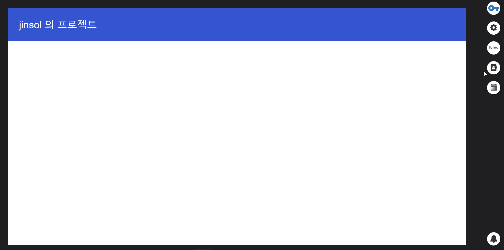  
>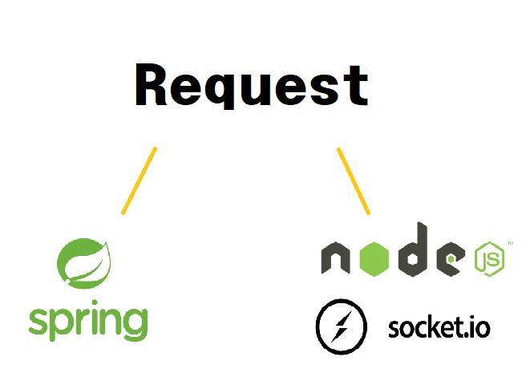  
**두가지의 서버에서 데이터를 주고받는 방식**
>
>---------
>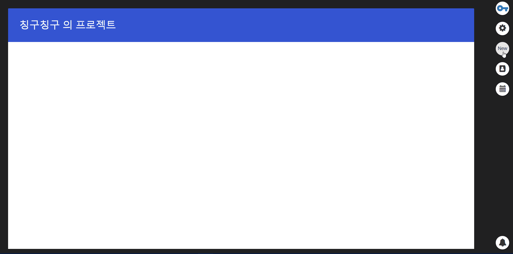
>  
>**친구신청 & 수락**  
>친구 신청과 수락은 Spring Framework 를 구동하는 80 port 에 데이터를 전송하여 처리하고 
>실시간 알림을 위해 3001 port 를 사용하는 알림 전용 서버로 동시에 데이터를 전송한다. 
>각 서버가 서로 다른 처리를 하여 더욱 효율적인 처리가 가능하다. 
>
>---------
>  
>**간단한 프로젝트 생성과 탈퇴**  
>직관적인 UI와 최소한의 정보로 프로젝트를 생성하고 탈퇴한다. 
>
>---------
>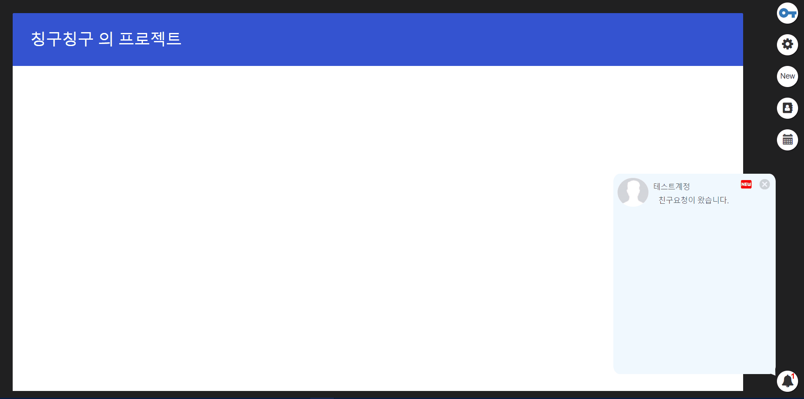  
>**실시간으로 프로젝트 초대장 발송**  
>초대받은 유저가 바로 인지하기 위하여 
>오른쪽 하단 알림창에 초대장 발송 내역이 즉시 보인다. 

---------------------------------------

>다양한 기능의 채팅
>---------
>
>
>---------
>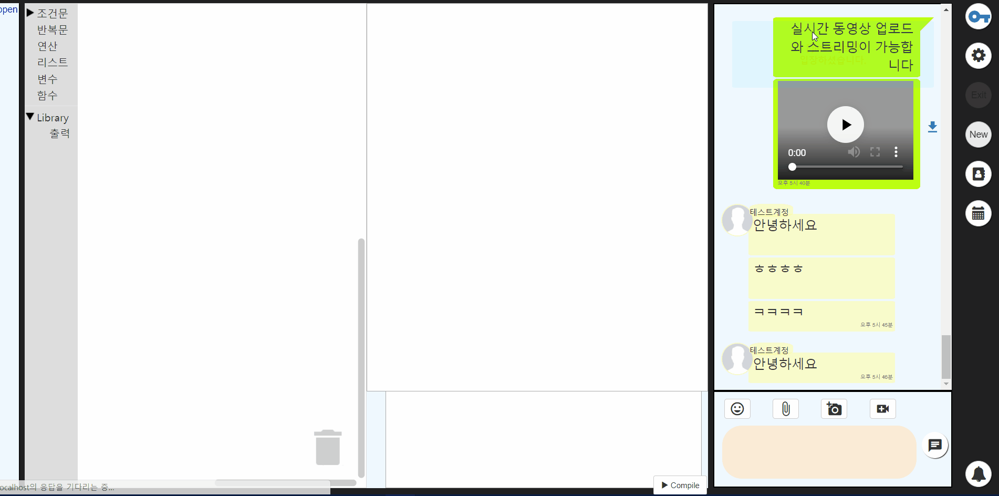 
>
>**채팅방 알림**  
>채팅방 입장 알림과 이전 채팅 내용을 확인할 때 
>새로운 메세지를 전송받으면 해당 메세지의 정보를 알려준다. 
>
>---------
>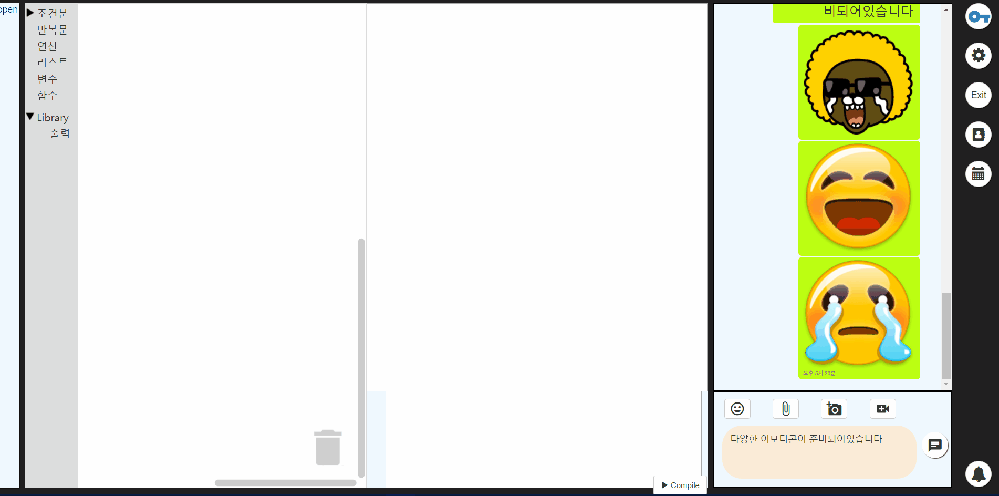 
>
>**100여가지 이상의 이모티콘**  
>가지각색의 이모티콘으로 상황에 맞는 의사표현이 가능하다. 
>이모티콘은 버튼 하나만 누르면 간단하게 사용이 가능하다. 
>
>---------
>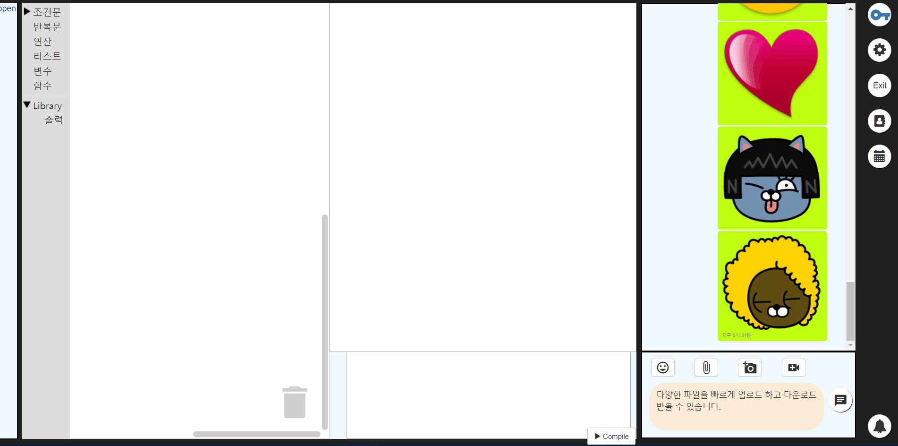 
>
>**빠르고 간편한 파일 첨부와 다운로드**  
>node.js 의 express 에 multer middleware 를 사용하여 
>쉽고 빠른 업 & 다운로드를 구현하였다. 
>
>---------
>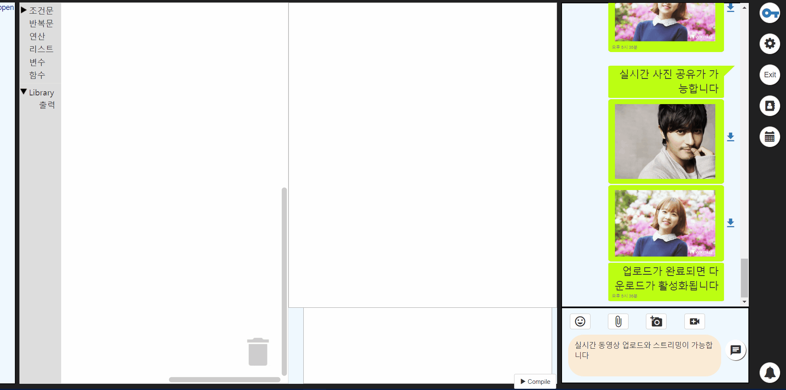 
>
>**동영상 업로드와 실시간 스트리밍 서비스**  
>또한 node.js 서버단에 vid-streamer 를 이용하여 스트리밍 전용 서버를 구성하고 
>사용자는 브라우저가 동영상을 읽는 동시에 동영상 시청이 가능하다. 
>
>---------
>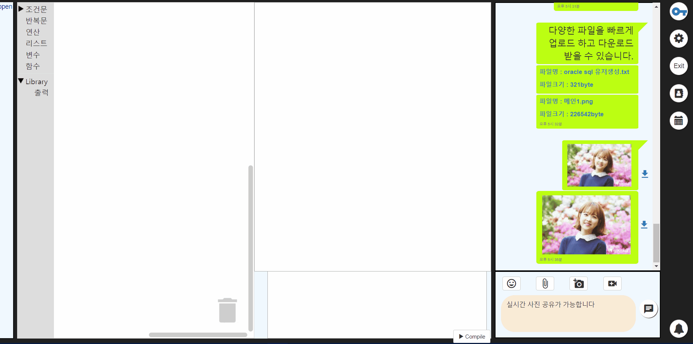 
>
>**사진첨부는 File API 를 이용한 빠른 미리보기와 다운로드를 제공**  
>여러가지 사진을 한번에 첨부할 수 있다. 
>사진첨부는 파일/동영상과 달리 Spring 서버단에서 읽기 쓰기가 이루어진다. 
>   
>
>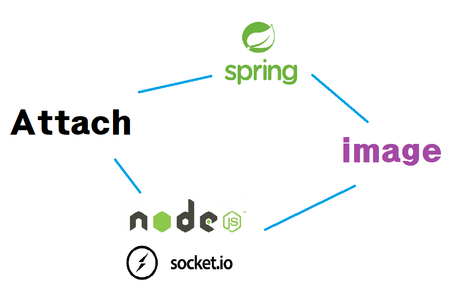  
>1. 첨부와 동시에 javascript에서 File API로 해당 이미지를 읽어 socket 통신을 진행 
>2. spring 서버단에서 DB에 정보를 입력하고 파일쓰기 진행 
>3. 브라우저로 File API에서 읽어낸 미리보기 정보 전송/첨부 이미지 확인 
>4. spring 서버단에서 파일쓰기가 완료되면 브라우저로 해당 정보 전송 
>5. 쓰기가 완료된 이미지들의 다운로드 활성화 
> 
>
> 파일 및 동영상은 ***node*** 서버단에서 읽고 쓰지만 사진의 읽기 쓰기는 ***spring*** 에서 진행되며 
> 파일 읽기는 google 의 guava lib 를 이용하였다. 
> 채팅방에 참여한 유저들이 다수의 파일 쓰기가 끝나기 전에  이미지를 확인하는 
> **비동기적 읽기/쓰기 방식을 개발**  
>
>---------

---------------------------------------

>프로젝트 구조
>---------
>**domain / controller / service / impl** 
>
>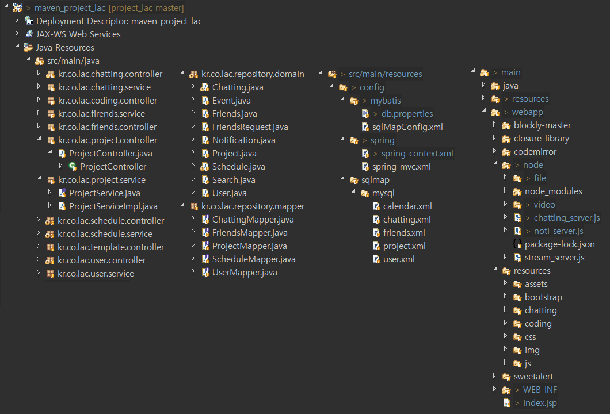  
>  

---------------------------------------
>ERD - [MySQL]
>---------
>
>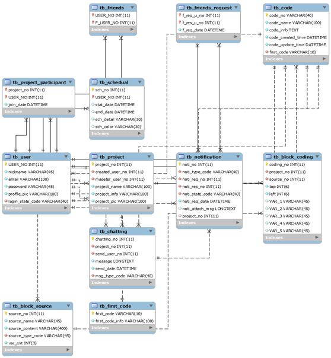  

---------------------------------------

>버젼관리
>---------
>**소스트리를 사용하여 수정 및 업데이트가 있을때마다 수시로 관리** 
>
>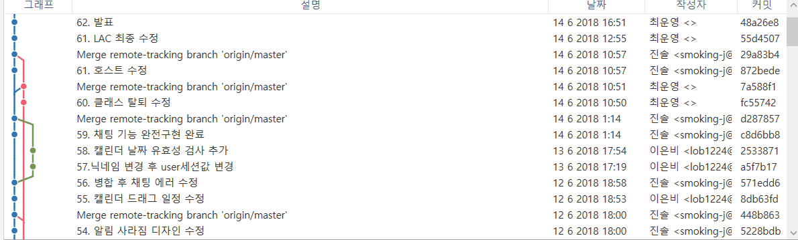 

---------------------------------------

***maven_project_lac v 1.0***